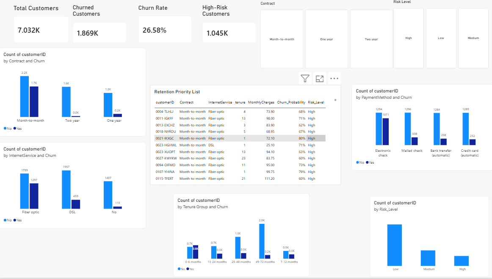

# Customer Churn Prediction & Retention Analytics

An end-to-end Business Analytics project that uses Python, SQL, Machine Learning, and Power BI to analyze customer churn, identify high-risk customers, and support data-driven retention strategies.

## Project Overview

Customer churn is a major business challenge because losing existing customers can impact revenue and customer lifetime value.

This project analyzes the IBM Telco Customer Churn dataset to:

- Understand customer churn patterns
- Identify factors associated with churn
- Build a machine learning model to predict churn probability
- Segment customers into Low, Medium, and High risk
- Create a Power BI dashboard for retention analytics
- Identify high-risk customers for targeted retention efforts

## Tools & Technologies

- Python
- Pandas
- NumPy
- Scikit-learn
- SQLite / SQL
- Power BI
- Jupyter Notebook
- GitHub

## Key Results

- **Total Customers:** 7,032
- **Churned Customers:** 1,869
- **Overall Churn Rate:** 26.58%
- **High-Risk Customers:** 1,045
- **Model ROC-AUC:** 0.836
- **Model Accuracy:** 80.53%

## Key Insights

- Month-to-month contract customers showed substantially higher churn than customers on longer-term contracts.
- Customers with shorter tenure showed higher churn rates.
- Fiber optic customers had higher churn than DSL and customers without internet service.
- Churned customers had higher average monthly charges than customers who stayed.
- The machine learning model helps identify customers with higher predicted churn probability.

## Machine Learning

A Logistic Regression model was developed to predict customer churn.

The workflow included:

1. Data cleaning
2. Feature preparation
3. Categorical variable encoding
4. Train-test split
5. Model training
6. Churn probability prediction
7. Risk-level classification

Customers were classified as:

- **Low Risk:** <30% predicted churn probability
- **Medium Risk:** 30–60%
- **High Risk:** >60%

## Power BI Dashboard

The dashboard includes:

- Customer and churn KPIs
- Churn by contract type
- Churn by tenure group
- Churn by internet service
- Churn by payment method
- Risk-level distribution
- High-risk customer retention priority list
- Interactive Contract and Risk Level filters

## Project Structure

- Customer_Churn_Analysis.ipynb
- Customer_Churn_Analytics.pbix
- powerbi_customer_churn_data.csv
- customer_churn_predictions.csv
- priority_retention_customers.csv
- final_customer_churn_data.csv
- kpi_summary.csv
- risk_summary.csv
- customer_churn.db
- telco-customer-churn-by-IBM.csv

## Business Objective

The objective is not only to predict which customers may churn, but to turn those predictions into actionable retention insights.

The high-risk customer segment can help a business prioritize customers for retention campaigns, personalized offers, service reviews, or proactive engagement.

## Dataset

The project uses the IBM Telco Customer Churn sample dataset.

The dataset is intended for analytics and demonstration purposes and represents fictional telecommunications customer data.
